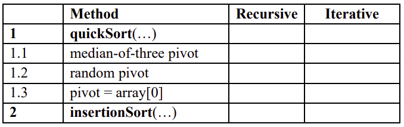

# Seminar 1
This document is in regard to my work on seminar 1 in  [DA256E HT23 Algorithms and Data Structures](https://hkr.instructure.com/courses/6279)

This is a summary of the seminar 1 description for me to easy navigate while i work

## Task 1
You should implement 2 sorting algorithms using both Iteration and Recursion.

Each method shall use the algorithm to sort a given array of numbers. Note, that the
algorithm must be the one described in the book (see [1]). Each method must be
implemented as:  
a) an iterative method or.  
b) a recursive method.  
Note! If is an iterative method – you are not allowed to use recursion!!!

### requirements for code

- [ ] insert algo from book quickSort Recursive
- [ ] insert algo from book quickSort Iterative
- [ ] insert algo from book insertionSort Recursive
- [ ] insert algo from book insertionSort Iterative
- [ ] code method to import rnd nmr from seminar file
- [ ] code so that the prog messure time to execute
- [ ] 

----------

## References
1. Weiss, Mark. A. (2012), Data structures and algorithm analysis in Java. 3rd edition
   Harlow, Essex : Pearson. (632 p)
